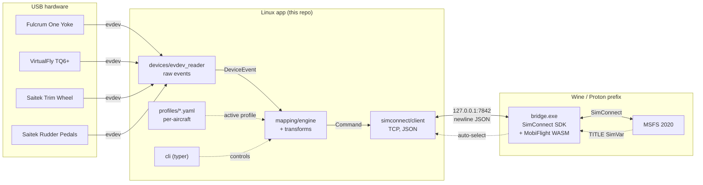

# msfs-peripherals-bridge

Map Linux USB flight-sim peripherals to **Microsoft Flight Simulator 2020**
SimVars and events — with **per-aircraft mapping profiles**.

> ### 👉 Start here
> - **The complete user manual** — install, devices, mapping, sharing profiles, the Wine bridge, flying; beginner-friendly, GUI *and* terminal → **[docs/MANUAL.md](docs/MANUAL.md)**
> - **How it works under the hood** → **[docs/bridge-concept.md](docs/bridge-concept.md)**.
> - **A map of every document** → **[docs/README.md](docs/README.md)**.

MSFS runs under **Proton/Wine** on Linux. The peripherals (Fulcrum One yoke,
VirtualFly TQ6+, Saitek Cessna trim wheel, Saitek rudder pedals) are read
natively on Linux via `evdev`. Because `SimConnect.dll` only lives inside the
Wine prefix, a tiny **bridge process runs in Wine** and exposes SimConnect over
a local TCP socket. The Linux app reads the hardware, applies the active
aircraft profile, and streams the resulting events/SimVars to that bridge.

> Status: **working in-sim.** The mapping engine, profile system, transforms and
> CLI are implemented and tested; the Wine-side bridge (`bridge.py`,
> Python-SimConnect — [`bridge/README.md`](bridge/README.md)) is **validated
> against MSFS**: axes and K: events reach the sim and per-aircraft profiles
> drive real flights (Piper Arrow, Cessna 152/172). Reading SimVars back
> (`msfs-bridge read`, e.g. the AP heading bug) goes through the subscribe/state
> channel, and dynamic **`event_from_var`** buttons read-then-fire on press (the
> Arrow's heading-bug-sync rocker). Still open: `L:/H:/B:` add-on LVars need the
> MobiFlight WASM channel, and TITLE auto-profile is not yet wired into `run`.

---

## Why a bridge?

| Approach | SimVars/Events | Linux-native | Chosen |
|----------|:-------------:|:------------:|:------:|
| Virtual `uinput` joystick | ❌ axes/buttons only | ✅ | no |
| **SimConnect bridge in Wine** | ✅ full access | ⚠️ needs Wine helper | **yes** |

Joystick passthrough can't reach named SimVars or H-events, which is exactly
what differentiated per-aircraft mappings need — hence the bridge.

---

## Architecture



<details>
<summary>ASCII fallback</summary>

```
 USB devices            Linux app (native)                  Wine/Proton prefix
 ───────────            ──────────────────                  ──────────────────
 Yoke   ┐                                                    ┌───────────────┐
 TQ6+   ├─ evdev ─▶ evdev_reader ─▶ mapping engine ─▶ bridge client
 Trim   │                 ▲              ▲                │  socket 7842   │
 Pedals ┘                 │         profiles/*.yaml       │  bridge.exe    │
                          │         (per aircraft)        │   │ SimConnect  │
                          └──── aircraft TITLE ◀──────────┤   ▼             │
                                  (auto-select)           │  MSFS 2020      │
                                                          └───────────────┘
```
</details>

### Data flow

1. `evdev_reader` discovers catalog devices (`config/devices.yaml`) by USB id
   and emits normalised `DeviceEvent`s (one thread per device).
2. `MappingEngine` looks up the bindings of the **active aircraft profile** for
   that device + control, shapes axis values (`deadzone → curve → invert →
   rescale`), and produces `SendEvent` / `SetSimVar` commands.
3. `BridgeClient` sends those commands as newline-delimited JSON to the Wine
   bridge, which calls the SimConnect SDK (and the MobiFlight WASM module for
   SimVars/H-events).
4. The bridge streams the aircraft `TITLE` SimVar back so the app can
   **auto-select** the matching profile.

---

## Quick start (CLI / developers)

Not a developer? Use the **[Manual](docs/MANUAL.md)** instead — same result,
step by step, no terminal knowledge needed.

```bash
# 0. Get the code and run the one-shot installer:
#    installs uv (brings Python), creates the venv + all packages, and the udev rules.
git clone https://github.com/creativeSloth/msfs-peripherals-bridge.git
cd msfs-peripherals-bridge
./install.sh

# 1. Explore
uv run msfs-bridge list-devices     # which configured devices are connected
uv run msfs-bridge list-profiles    # available aircraft profiles
uv run msfs-bridge validate         # check catalog + profiles

# 2. Try the mapping without a sim (logs commands instead of sending them)
uv run msfs-bridge run --profile cessna_172 --dry-run -v

# 3. Real run (needs the Wine bridge running, see bridge/README.md)
uv run msfs-bridge run --aircraft "Cessna 172 Skyhawk"

# 4. Read a SimVar back from the sim (bridge up), e.g. the AP heading bug
uv run msfs-bridge read "AUTOPILOT HEADING LOCK DIR" --unit degrees
```

Prefer to do it by hand instead of `./install.sh`? `uv sync --extra dev` builds
the venv, and the udev step is `sudo cp 999-flightsim-override.rules
/etc/udev/rules.d/99-flightsim.rules && sudo udevadm control --reload-rules &&
sudo udevadm trigger`. The GUI additionally needs **Tk** from your distribution
(`python3-tk` · `python3-tkinter tk` · `tk`) — it is not part of Python and not
something `uv` can install.

The full command list as copy-paste lines is in
[`docs/cheatsheet.md`](docs/cheatsheet.md).

Setting up on a fresh machine — **your own hardware**, registering devices, the
Wine bridge, finding your MSFS Proton prefix, tuning a mapping live with
`--dry-run -v`? The complete step-by-step manual is the
**[Manual](docs/MANUAL.md)**.

---

## Configuration

- **`config/devices.yaml`** — the device catalog (USB vendor/product → stable
  `id`). The Fulcrum yoke id is still a placeholder; confirm it with `lsusb`.
- **`profiles/<aircraft>.yaml`** — one profile per aircraft. Schema and a fully
  commented example are in [`profiles/_schema.md`](profiles/_schema.md).
  Auto-selection matches `aircraft_match` substrings against the loaded
  aircraft's `TITLE`.

Finding the right axis/button codes for your hardware:

```bash
sudo apt install evtest && sudo evtest   # pick a device, wiggle a control
```

---

## Project layout

```
src/msfs_peripherals_bridge/
  models.py            Pydantic schema for devices, bindings, profiles
  config.py            path resolution (profiles/, config/)
  devices/             evdev discovery + normalised DeviceEvent
  mapping/             transforms, engine, YAML loader + profile selection
  simconnect/          bridge client + JSON wire protocol
  runtime.py           threaded glue: read → map → dispatch
  cli.py               `msfs-bridge` command (typer)
profiles/              per-aircraft YAML profiles
config/devices.yaml    device catalog
bridge/                Wine-side SimConnect bridge spec
tests/                 pytest suite (pure logic, no hardware needed)
docs/memory/           project knowledge base (see MEMORY.md)
```

---

## Development

```bash
uv run pytest          # tests
uv run ruff check .    # lint
uv run ruff format .   # format
uv run mypy            # type-check
```

CI (`.github/workflows/ci.yml`) runs lint, type-check and tests on every push
and pull request.

## Knowledge base

Project background, decisions and component notes live in
[`MEMORY.md`](MEMORY.md), which links to the sub-memories under
[`docs/memory/`](docs/memory/).

## License

MIT — see [LICENSE](LICENSE).
