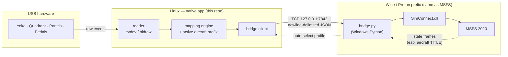
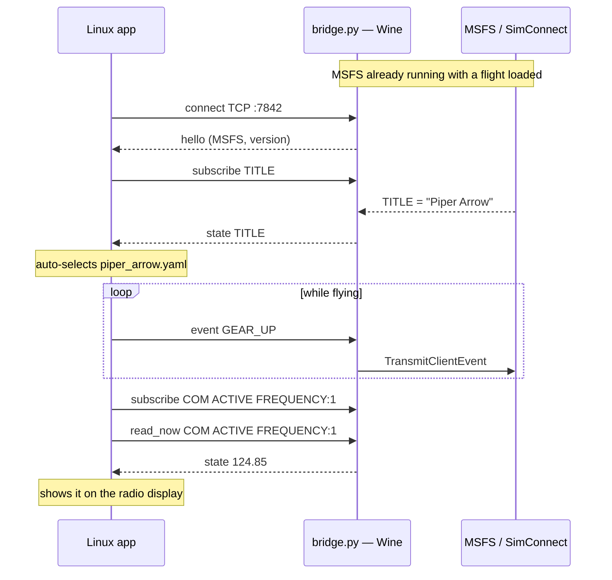

# How the bridge works

*A short explainer for the curious — no need to read the code first. For the
exact wire spec and SimConnect calls, see [`../bridge/README.md`](../bridge/README.md).*

## The problem in one paragraph

MSFS talks to add-ons through **SimConnect** — but `SimConnect.dll` only exists
**inside the Windows/Wine world** where MSFS runs (under Proton on Linux). Your
USB hardware, on the other hand, is easiest to read **natively on Linux**
(`evdev`/`hidraw`). So there is a wall between the two: the side that can read
your yoke can't call SimConnect, and the side that can call SimConnect can't
read your yoke.

**The bridge is a tiny program that lives on the MSFS side of the wall** and
opens a door through it: a local TCP socket. The Linux app reads the hardware
and sends small JSON messages through that door; the bridge turns each one into
a real SimConnect call. That's the whole trick.

## The round trip

Reading left to right: a switch you flip becomes a **raw event**; the **mapping
engine** looks up what that control does *in the current aircraft* (from a
`profiles/<aircraft>.yaml` file) and shapes axis values (deadzone → curve →
invert → rescale); the result is a **command** sent as one line of JSON over the
socket; the **bridge** calls SimConnect; MSFS reacts.

The dotted line back is the clever bit: the bridge continuously streams the
loaded aircraft's `TITLE` back, so the app can **auto-select the matching
profile** — plug-and-fly, no manual switching.

## What travels over the socket

Everything is one JSON object per line. A handful of message types ("ops") cover
all cases:

| Direction | Op | Meaning |
|---|---|---|
| app → bridge | `event` | fire a K: event (most buttons/axes) |
| app → bridge | `simvar` | set a writable SimVar (`A:` directly, `L:` via WASM) |
| app → bridge | `subscribe` | watch a SimVar; get `state` frames when it changes |
| app → bridge | `read_now` | read a subscribed SimVar **immediately** (for displays) |
| app → bridge | `event_from_var` | read a var *now*, then fire an event with that value |
| app → bridge | `rpn` | run a small RPN snippet (stateless toggles a fixed event can't express) |
| bridge → app | `hello` | handshake: which sim + version |
| bridge → app | `state` | a subscribed SimVar's current value (incl. `TITLE`) |

Most of a flight is just a stream of `event` messages. The read-back ops
(`subscribe`/`read_now`/`event_from_var`) are what let the app **react to the
sim** — e.g. drive a 7-segment display, or sync a heading bug to the current
heading the instant you press the knob (reading at press time avoids polling
lag).

## A session, start to finish

## Why this design

- **Python + [Python-SimConnect](https://pypi.org/project/SimConnect/), not C++.**
  The pip package **bundles `SimConnect.dll`**, so there's no MSFS SDK and no
  MinGW toolchain to fight — `setup-prefix.sh` just installs a Windows Python +
  that package into the prefix.
- **TCP/JSON, not a shared library.** It keeps the two worlds fully decoupled:
  the Linux app never links anything Windows, and the bridge is a small
  self-contained script. You can even watch or debug the wire with plain text.
- **A supervisor keeps it alive.** A hard MSFS crash can take the Wine-Python
  down with it, so `run-bridge.sh` restarts the bridge in a loop; `bridge.py`
  then waits for SimConnect to come back and re-attaches.

## Current limits

- `L:` / `H:` / `B:` **add-on local variables** need the **MobiFlight WASM
  module** in the MSFS Community folder — plain SimConnect can't set them. Normal
  `A:` SimVars and `K:` events work without it.

## Where the code lives

- **`bridge/bridge.py`** — the Wine-side bridge (self-contained, copied into the prefix).
- **`bridge/README.md`** — the exact protocol frames and SimConnect calls.
- **`src/msfs_peripherals_bridge/simconnect/`** — the Linux client + `protocol.py` (the source of truth for the ops above).
- **`src/msfs_peripherals_bridge/runtime.py`** — the read → map → dispatch glue.
